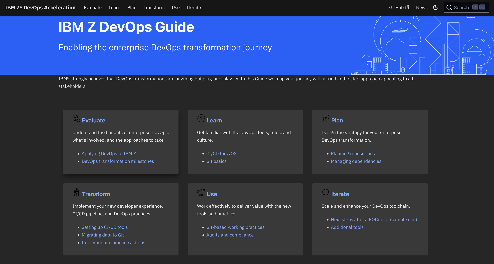
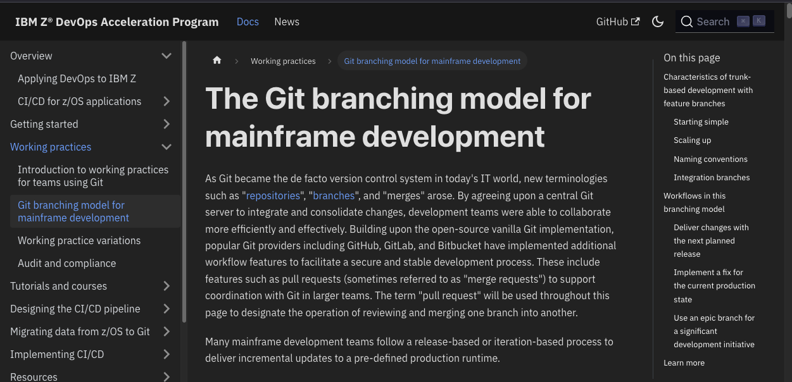
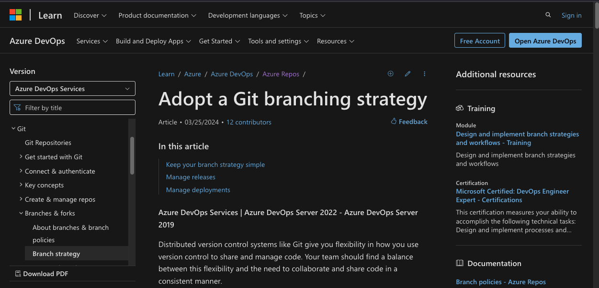
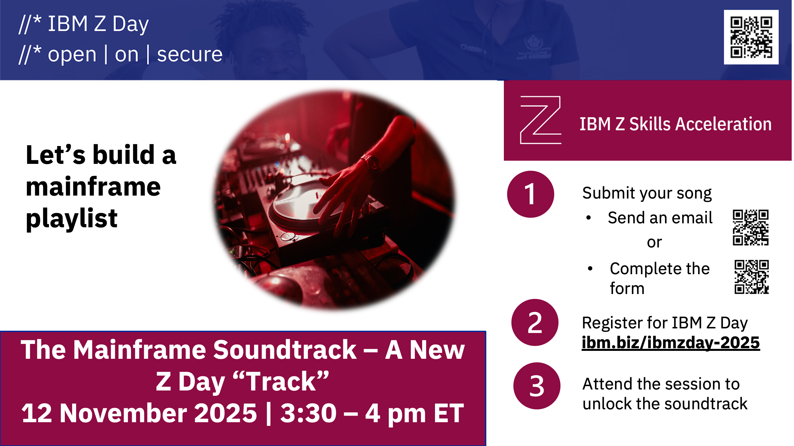

## Agenda

- Recap the basics of the recommended branching scheme
    - Focuses on the developer workflow
- "[Environment]{style="color:green;"} branches" - yes, no or meh!
    - What's the point in hanging on to old practices?
    - It's just words... but words matter!
- The pipelines in action - demo time! 

## Setting the context

- Devops is foundational to modernization.

- Modernization of Devops is no longer a voyage of exploration.

  - (But plenty people will still try to convince you otherwise!)

- No single tool or approach covers the entire journey to the destination.

We have a [Guide](https://ibm.github.io/z-devops-acceleration-program/docs/ibm-z-devops-solution)... yes, it would be better if it were a map!

## The Guide



## Today's topic - Branching Strategy for Mainframe Teams



## ... don't just take our word for it



[Microsoft Azure Devops Services](https://learn.microsoft.com/en-us/azure/devops/repos/git/git-branching-guidance?view=azure-devops)

# The Branching Strategy (Recap)

## Starting Simple {.smaller}

Every change starts in a branch.

```{mermaid}
---
config:
  fontFamily: "IBM Plex Sans"
  gitGraph:
    showCommitLabel: false
---
gitGraph
  commit
  commit
  branch feature/001
  commit
```

- Developers work in the branch to make changes, perform user builds and unit tests.

- A branch holds multiple commits (changes to multiple files).

## Starting Simple {.smaller}

Every change starts in a branch.

```{mermaid}
---
config:
  fontFamily: "IBM Plex Sans"
  gitGraph:
    showCommitLabel: false
---
gitGraph
  commit
  commit
  branch feature/001
  commit
  commit
```

These changes on these branches are 

- built,
- tested, 
- reviewed and 
- approved before merging to `main`.

## Preparing to Merge into `main` {.smaller}

Feature Team/Developers will:

- Build
  - Builds may be done to any commit on any branch
  - Feature branch **must** build cleanly for a Pull Request
- Test
  - To prove quality of the changes in their feature branch

```{mermaid}
---
config:
  fontFamily: "IBM Plex Sans"
  gitGraph:
    showCommitLabel: false
---
gitGraph
  commit
  commit
  branch feature/001
  commit
  commit
  checkout main
  merge feature/001
```
# [Environment]{style="color:green;"} branches - yes, no or meh!

## The Route to Live

Comparing the recommended branching scheme to some common legacy patterns for workflows and build/deploy schemes

- These [environments]{style="color:green;"} dominate the terminology and workflows with which the teams are familiar
- So there is an adjustment required to be fully comfortable with the recommended model

## Branches for [environments]{style="color:green;"}

Typically

- *DEV*
- *TEST*
- *PROD*

Let's look at the workflow for a set of features in a release.

## Hanging on to legacy workflows

The following diagrams adopt the old names for:

- branches where developers work ('*DEV*'),
- branches representing versions of the code base which are built and deployed to systems where formal tests are executed ('*TEST*') and
- branches representing the state of the deployed system in production ('*PROD*')

and shows associated build pipelines and systems on to which the built packages are deployed. 

::: notes
The pipelines targeting each [environment]{style="color:green;"} may inject some characteristics specific to each [environment]{style="color:green;"}.

Obviously we maintain the principle that features will be implemented first in *DEV* and progress through one or more *TEST* branches and [environments]{style="color:green;"} before deployment to *PROD*. 

Equally obviously, *feature* branches are used by developers before they merge into *DEV*.

In order to be included in the pipeline build for any [environment]{style="color:green;"}, the commits implementing a feature must be merged into the branch for that [environment]{style="color:green;"}. Build˚vs are performed for any [environment]{style="color:green;"}.

When one or more features are code-complete and merged into the *DEV* branch a new build is performed for deployment to the *DEV* [environment]{style="color:green;"}.
:::

## Starting a development cycle {.smaller}

```{mermaid}

gitGraph
  commit
  branch TEST order: 5
  branch DEV  order: 10
  commit tag: "2.1.0"
  commit
  branch feature-001 order: 15
  commit
  checkout DEV
  branch feature-002 order: 15
  commit
```

Both features for *release 2.1.0* are developed in their own dedicated branches.

## Completing a feature

*Feature-001* completes first and a PR is used to review and approve its merge into the *DEV* branch.

*DEV* is built, and the build is deployed to a *DEV* **[environment]{style="color:green;"}**.

```{mermaid}
---
config:
  fontFamily: "IBM Plex Sans"
  gitGraph:
    showCommitLabel: false
    mainBranchName: "PROD"
    mainBranchOrder: 2
---
gitGraph
  commit
  branch TEST order: 5
  branch DEV  order: 10
  commit tag: "2.1.0"
  commit
  branch feature-001 order: 15
  commit
  checkout DEV
  branch feature-002 order: 15
  commit
  checkout DEV
  merge feature-001
  commit tag: "1.build and deploy to DEV env"
```

## And another one...

The same workflow is performed when the second feature planned for the release is ready to be merged into *DEV*.

::: notes
It's implicit that the feature-002 branch is synchronized with *DEV* after feature-001 is merged to *DEV* (at least before feature-002 can be merged with *DEV*).
:::

```{mermaid}
---
config:
  fontFamily: "IBM Plex Sans"
  gitGraph:
    showCommitLabel: false
    mainBranchName: "PROD"
    mainBranchOrder: 2
---
gitGraph
  commit
  branch TEST order: 5
  branch DEV  order: 10
  commit tag: "2.1.0"
  commit
  branch feature-001 order: 15
  commit
  checkout DEV
  branch feature-002 order: 15
  commit
  checkout DEV
  merge feature-001
  commit tag: "1.build and deploy to DEV env"
  checkout feature-002
  commit
  checkout DEV
  merge feature-002
  commit tag: "2.build and deploy to DEV env"
```
## Testing features together

As these two features are now merged onto the *DEV* branch, they can be promoted together onto the *TEST* branch

 - By performing a new combined build and deployment to the *TEST* **[environment]{style="color:green;"}**.
 - Here a problem is discovered and a fix to *TEST* is developed in a branch, merged into *TEST*, built and deployed for validation.

::: notes
How can I test feature001 in the *TEST* environment without waiting on feature002 ?
Or a different scenario:
feature001 and feature002 are both in *DEV*, and the developer of feature001 wants to enter *TEST* already - how would I do this?
:::

## Testing and fixing problems {.smaller}

```{mermaid}
---
config:
  fontFamily: "IBM Plex Sans"
  gitGraph:
    showCommitLabel: false
    mainBranchName: "PROD"
    mainBranchOrder: 2
---
gitGraph
  commit
  branch TEST order: 5
  branch DEV  order: 10
  commit tag: "2.1.0"
  commit
  branch feature-001 order: 15
  commit
  checkout DEV
  branch feature-002 order: 15
  commit
  checkout DEV
  merge feature-001
  commit tag: "1.build and deploy to DEV env"
  checkout feature-002
  commit
  checkout DEV
  merge feature-002
  commit tag: "2.build and deploy to DEV env"
  checkout TEST
  merge DEV
  commit tag: "3.build and deploy to TEST env"
  branch testfix-001 order: 4
  commit
  commit
  checkout TEST
  merge testfix-001
  commit tag: "4.build and deploy to TEST env"
```
## Deploying to production {.smaller}
After a successful test cycle, a PR is used to review and approve the merging of *TEST* (which now includes both planned new features) into the *PROD* branch.

This is followed by a build and deployment to the *PROD* **[environment]{style="color:green;"}**.

```{mermaid}
---
config:
  fontFamily: "IBM Plex Sans"
  gitGraph:
    showCommitLabel: false
    mainBranchName: "PROD"
    mainBranchOrder: 2
---
gitGraph
  commit
  branch TEST order: 5
  branch DEV  order: 10
  commit tag: "2.1.0"
  commit
  branch feature-001 order: 15
  commit
  checkout DEV
  branch feature-002 order: 15
  commit
  checkout DEV
  merge feature-001
  commit tag: "1.build and deploy to DEV env"
  checkout feature-002
  commit
  checkout DEV
  merge feature-002
  commit tag: "2.build and deploy to DEV env"
  checkout TEST
  merge DEV
  commit tag: "3.build and deploy to TEST env"
  branch testfix-001 order: 4
  commit
  commit
  checkout TEST
  merge testfix-001
  commit tag: "4.build and deploy to TEST env"
  checkout PROD
  merge TEST
  commit tag: "5.build and deploy to PROD env"
```

## Fixing production problems {.smaller}

A HotFix is needed. 

This is developed, reviewed and merged into the *PROD* branch with a new build and deployment to the *PROD* **[environment]{style="color:green;"}** performed.

```{mermaid}
---
config:
  fontFamily: "IBM Plex Sans"
  gitGraph:
    showCommitLabel: false
    mainBranchName: "PROD"
    mainBranchOrder: 2
---
gitGraph
  commit
  branch TEST order: 5
  branch DEV  order: 10
  commit tag: "2.1.0"
  commit
  commit tag: "3.build and deploy to TEST env"
  branch testfix-001 order: 4
  commit
  commit
  checkout TEST
  merge testfix-001
  commit tag: "4.build and deploy to TEST env"
  checkout PROD
  merge TEST
  commit tag: "5.build and deploy to PROD env"
  branch hotfix-001 order: 1
  commit
  checkout PROD
  merge hotfix-001
  commit tag: "6.build and deploy to PROD env"
```
## The next development cycle

Now the testing and release cycle for *release 2.1.0* is complete, both the *TEST* and *PROD* branches have fixes which need to be synchronized to *DEV*. 

Since all the commits missing from *DEV* are present on *PROD*, we just `git merge` from *PROD* into *DEV*. And also from *PROD* into *TEST*.

::: notes
And this is where you begin to ENTER the MERGE HELL
:::

## 
```{mermaid}
---
config:
  fontFamily: "IBM Plex Sans"
  gitGraph:
    showCommitLabel: false
    mainBranchName: "PROD"
    mainBranchOrder: 2
---
gitGraph
  commit
  branch TEST order: 5
  branch DEV  order: 10
  commit tag: "2.1.0"
  commit
  branch feature-001 order: 15
  commit
  checkout DEV
  branch feature-002 order: 15
  commit
  checkout DEV
  merge feature-001
  commit tag: "1.build and deploy to DEV env"
  checkout feature-002
  commit
  checkout DEV
  merge feature-002
  commit tag: "2.build and deploy to DEV env"
  checkout TEST
  merge DEV
  commit tag: "3.build and deploy to TEST env"
  branch testfix-001 order: 4
  commit
  commit
  checkout TEST
  merge testfix-001
  commit tag: "4.build and deploy to TEST env"
  checkout PROD
  merge TEST
  commit tag: "5.build and deploy to PROD env"
  branch hotfix-001 order: 1
  commit
  checkout PROD
  merge hotfix-001
  commit tag: "6.build and deploy to PROD env"
  checkout TEST
  merge PROD
  checkout DEV
  merge PROD
```
*DEV* is now identical to *PROD*.

Just as at the beginning of *release 2.1.0*, a new tag is used to demarcate the beginning of a new release cycle.

##

```{mermaid}
---
config:
  fontFamily: "IBM Plex Sans"
  gitGraph:
    showCommitLabel: false
    mainBranchName: "PROD"
    mainBranchOrder: 2
---
gitGraph
  commit
  branch TEST order: 5
  branch DEV  order: 10
  commit tag: "2.1.0"
  commit
  branch feature-001 order: 15
  commit
  checkout DEV
  branch feature-002 order: 15
  commit
  checkout DEV
  merge feature-001
  commit tag: "1.build and deploy to DEV env"
  checkout feature-002
  commit
  checkout DEV
  merge feature-002
  commit tag: "2.build and deploy to DEV env"
  checkout TEST
  merge DEV
  commit tag: "3.build and deploy to TEST env"
  branch testfix-001 order: 4
  commit
  commit
  checkout TEST
  merge testfix-001
  commit tag: "4.build and deploy to TEST env"
  checkout PROD
  merge TEST
  commit tag: "5.build and deploy to PROD env"
  branch hotfix-001 order: 1
  commit
  checkout PROD
  merge hotfix-001
  commit tag: "6.build and deploy to PROD env"
  checkout TEST
  merge PROD
  checkout DEV
  merge PROD
  commit tag: "2.2.0"
  branch feature-003 order: 20
  commit
  checkout DEV
  merge feature-003
  commit tag: "7.build and deploy to DEV env"
  checkout TEST
  merge DEV
  commit tag: "8.build and deploy to TEST env"
  checkout PROD
  merge TEST
  commit tag: "9.build and deploy to PROD env"
```

The cycle for *Release 2.2.0* goes smoothly with Feature-003 reviewed, approved, merged and tested into *DEV*, *TEST* and *PROD* with no need for any fixes! 

::: notes
(Which means there are no commits made to either *TEST* or *PROD* that need to go back to *DEV*.)
:::

# Comparing to the recommended model

## Names, words and interpretation

The recommended model uses the industry-standard terms for branches in workflows
reflecting common views of the roles they play.

- Do these conflict with the legacy terms, or are they interpretations of the model
achieving equivalent outcomes more easily? 
- Is the legacy interpretation fundamentally 
different or close enough not to be a blocker on adoption?

## Changing the vocabulary

The following diagrams show the same basic workflow actions and elements, but with the names from the recommended model.

- A series of commits on `main` is equivalent to *DEV*
- A release build deployed into a test environment is equivalent to *TEST*
- Production versions (*PROD*) are demarcated by a Git tag on `main` - representing a series of releases builds that made it to production.

## 

```{mermaid}
---
config:
  fontFamily: "IBM Plex Sans"
  gitGraph:
    showCommitLabel: false
    mainBranchOrder: 5
---
gitGraph
  commit
  commit tag: "2.1.0"
  branch DEV-2.1.0  order: 10
  commit
  branch feature-001 order: 15
  commit
  checkout DEV-2.1.0
  branch feature-002 order: 15
  commit
  checkout DEV-2.1.0
  merge feature-001
  commit tag: "1.build and deploy to DEV env"
  checkout feature-002
  commit
  checkout DEV-2.1.0
  merge feature-002
  commit tag: "2.build and deploy to DEV env"
  checkout main
  merge DEV-2.1.0
  commit tag: "3.build and deploy to TEST env"
  branch testfix-001 order: 4
  commit
  commit
  checkout main
  merge testfix-001
  commit tag: "4.build and deploy to TEST env"
  branch PROD-2.1.0
  %% merge main
  commit tag: "5.build and deploy to PROD env"
  branch hotfix-001 order: 1
  commit
  checkout PROD-2.1.0
  merge hotfix-001
  commit tag: "6.build and deploy to PROD env"
  checkout main
  
```
# It's all the same!

## Starting a development cycle

```{mermaid}
---
config:
  fontFamily: "IBM Plex Sans"
  gitGraph:
    showCommitLabel: false
    mainBranchOrder: 5
---
gitGraph
  checkout main
  commit tag: "1.9.8"
  branch release/1.9.8
  commit 
```

::: notes
`main` is the most up to date branch at the beginning of every cycle.
Release 1.9.8 is currently deployed to production via a previous cycle which built, tested and deployed it from the main branch.

A new `release/1.9.8` branch is created as an release maintenance branch to be the integration branch for production fixes.

New features which will go into this next release cycle are added to main.
:::

## Features for the next release ...
```{mermaid}
---
config:
  fontFamily: "IBM Plex Sans"
  gitGraph:
    showCommitLabel: false
    mainBranchOrder: 5
---
gitGraph
  checkout main
  commit tag: "1.9.8"
  %% branch release/1.9.8
  %% commit
  checkout main 
  branch feature-001 order: 15
  commit
  checkout main
  branch feature-002 order: 15
  commit
```
As usual, features are developed in their own branches.

## Integrating features

```{mermaid}
---
config:
  fontFamily: "IBM Plex Sans"
  gitGraph:
    showCommitLabel: false
    mainBranchOrder: 5
---
gitGraph
  checkout main
  commit tag: "1.9.8"
  %% branch release/1.9.8
  %% commit
  checkout main 
  branch feature-001 order: 15
  commit
  checkout main
  branch feature-002 order: 15
  commit
  checkout main
  merge feature-001
  commit tag: "1.build and deploy to DEV env"
  checkout feature-002
  commit
  checkout main
  merge feature-002
  commit tag: "2.build and deploy to DEV env"
```
As each feature is completed, PRs are used to review, approve and merge them into the `main` branch where they can be tested together.

Again, it's implicit that the feature-002 branch is synchronized with *main* after feature-001 is merged to *main* (at least before feature-002 can be merged with *main*).

```{mermaid}
---
config:
  fontFamily: "IBM Plex Sans"
  gitGraph:
    showCommitLabel: false
    mainBranchOrder: 5
---
gitGraph
  branch PROD-1.9.8
  checkout main
  commit
  commit tag: "2.1.0"
  branch DEV-2.1.0  order: 10
  commit
  branch feature-001 order: 15
  commit
  checkout DEV-2.1.0
  branch feature-002 order: 15
  commit
  checkout DEV-2.1.0
  merge feature-001
  commit tag: "1.build and deploy to DEV env"
  checkout feature-002
  commit
  checkout DEV-2.1.0
  merge feature-002
  commit tag: "2.build and deploy to DEV env"
  checkout main
  merge DEV-2.1.0
  commit tag: "3.build and deploy to TEST env"
```
When both pass the tests for a DEV branch, a PR proposes a merge of them both to `main` where they can be reviewed and approved to be a release candidate.

## Testing and fixing problems ...{.smaller}

```{mermaid}
---
config:
  fontFamily: "IBM Plex Sans"
  gitGraph:
    showCommitLabel: false
    mainBranchOrder: 5
---
gitGraph
  checkout main
  commit tag: "1.9.8"
  %% branch release/1.9.8
  %% commit
  checkout main 
  branch feature-001 order: 15
  commit
  checkout main
  branch feature-002 order: 15
  commit
  checkout main
  merge feature-001
  commit tag: "1.build and deploy to DEV env"
  checkout feature-002
  commit
  checkout main
  merge feature-002
  commit tag: "2.build and deploy to DEV env"
  branch testfix-001 order: 15
  commit
  commit
  checkout main
  merge testfix-001
  commit tag: "3.build and deploy to DEV and TEST env"
```
Again, the bug is discovered in testing, and `testfix-001` is required. It's developed in a branch, reviewed and approved and the build and testing refreshed.


## Deploying to production

Now `main` has the new features and is passing the development tests, it's ready to consider a deployment to QA and then Production.

```{mermaid}
---
config:
  fontFamily: "IBM Plex Sans"
  gitGraph:
    showCommitLabel: false
    mainBranchOrder: 5
---
gitGraph
  checkout main
  commit tag: "1.9.8"
  %% branch release/1.9.8
  %% commit
  checkout main 
  branch feature-001 order: 15
  commit
  checkout main
  branch feature-002 order: 15
  commit
  checkout main
  merge feature-001
  commit tag: "1.build and deploy to DEV env"
  checkout feature-002
  commit
  checkout main
  merge feature-002
  commit tag: "2.build and deploy to DEV env"
  branch testfix-001 order: 15
  commit
  commit
  checkout main
  merge testfix-001
  commit tag: "3.build and deploy to DEV and TEST env"
  commit tag: "4.build release candidate to deploy to DEV/TEST/QA/PROD"
  commit tag: "2.0.0"
```
## Fixing production problems

`main` has evolved, and a production issue is reported. What now?

The bug which needs fixing is fixed with `fix-001` as a feature branch from the release maintenance branch `release/1.9.8`.

## 
```{mermaid}
---
config:
  fontFamily: "IBM Plex Sans"
  gitGraph:
    showCommitLabel: false
    mainBranchOrder: 10
    rotateCommitLabel: true
---
gitGraph
  checkout main
  commit tag: "1.9.8"
  branch release/1.9.8 order: 5
  commit
  checkout main 
  branch feature-001 order: 15
  commit
  checkout main
  branch feature-002 order: 15
  commit
  checkout main
  %% merge feature-001
  %% commit tag: "1.build and deploy to DEV env"
  merge feature-001 tag: "1.build and deploy to DEV env"
  checkout release/1.9.8
  branch fix/1.9.8/fix-001 order: 3
  checkout fix/1.9.8/fix-001
  commit 
  checkout release/1.9.8
  merge fix/1.9.8/fix-001 tag: "2.build and deploy to TEST/QA/PROD env" type: HIGHLIGHT
  checkout main
  merge release/1.9.8
  checkout feature-002
  commit
  checkout main
  merge feature-002 tag: "3.build and deploy to DEV env"
  commit 
```
## The next development cycle

To continue development for a *release 2.1.0*. Development of features on *DEV-2.2.0* proceeds in the usual way.
 
```{mermaid}
---
config:
  fontFamily: "IBM Plex Sans"
  gitGraph:
    showCommitLabel: false
    mainBranchOrder: 5
---
gitGraph
  checkout main
  commit tag: "2.0.0"
  %% branch release/1.9.8
  %% commit
  checkout main 
  branch feature-001 order: 15
  commit
  checkout main
  branch feature-002 order: 15
  commit
```

Build, testing and production deployment for next planned release 2.1.0 then proceeds as normal.

# Advantages of the recommended model

## `main` is the integration point {.smaller}

The *DEV* branch integrates multiple features before they are merged into *TEST*
 - which is the same role that the `main` branch has in the recommended model.

It signals that the target integration branch for developers
is functionally equivalent to a series of merged *feature* branches.

## Equivalence {.smaller}

Since *DEV* in the legacy and `main` in the recommended model would both be the target of merging new changes, it makes **[no functional difference]{style="color:yellow;"}** whether:

- a set of **long-lived** branches are maintained and continuously need to be refreshed, a.k.a rebase *DEV* with the `HEAD` of *TEST* if *TEST* has fixes
merged on to it OR
- a series of merged feature branches representing the changes for the next release.

It makes NO DIFFERENCE to the history or the validity of the `main` branch or the feature branches developers
work off if there's a single long-lived branch synchronized to the 
HEAD of *TEST* or if a new feature branch is created for fixing code for the next planned release from `main`.

## `main` is *TEST* {.smaller}

*TEST* is the integration branch for all new features - essentially identical to the
branch we call `main` in the recommended model, containing the series of new changes that are planned for the upcoming release.

- In legacy terms, *DEV* would advance ahead of *TEST* with feature branches being merged into it exactly
as feature branches would be ahead of `main` in the recommended model.
    - As commits from feature branches are merged into *DEV*, the *DEV* pipeline builds and deploys
testable packages to the *DEV* [environment]{style="color:green;"}. Having proven their goodness, a PR is 
created to merge *DEV* into *TEST*.

      **These additional are not required in the recommended model.**

::: notes
If nothing else has merged into *TEST* since the last PR from *DEV* then this is
straightforward. But if it's permitted for developers to merge commits for fixes 
into *TEST* without merging them into *DEV* first, then *DEV* and *TEST* will have
diverged and *DEV* will need to be brought up-to-date with the commits from *TEST* 
which are missing.

Commits normally merge according to the upward arrows in both diagrams, but there
are a number of downward pointing arrows - these signify synchronization
points where a branch which is normally a source of commits to another (*DEV* to *TEST*, 
*TEST* to *PROD*) need to incorporate commits which were made independently to the 
(normally) target branch.

This is exactly as `main` and *feature branches* are used. Thus *TEST* is playing the
role we assign to `main` in the recommended model. It seems entirely reasonable that
the branch to which developers aim to merge their work and which is the main stage
of testing has the conventional common name of `main`.
:::

## Release maintenance branches are identical to *PROD* {.smaller}

The legacy interpretation demands that commits for new features are merged from *TEST* to *PROD*, but also that
it is allowed for *hot-fixes* to be merged with *PROD* in emergencies.

- *TEST* cannot be behind *PROD* (ie missing any hot-fixes) when a new set of commits are to be released to *PROD*.

- Taking the commits from *TEST* which are newer than the last to *PROD* makes their histories identical.

This makes it functionally the same as creating git tags to label commits on `main` for release builds and create a release maintenance branch when required
in the recommended model.

# Summary

## Summary {.smaller}

- Legacy terminology is a blocker for alignment to common ways of working
    - and makes on-boarding harder
- Our recommended model decouples the state of the code from the [environments]{style="color:green;"}
    - for which the code is built
    - and where it is deployed

Words...

- *DEV* is equivalent to a series of changes
    - oriented to projects/features
- *TEST* is equivalent to `main`
    - so let's use the standard term
- *PROD* is equivalent to a series of release builds marked by tags deployed to production
    - all with the history and traceability we all need 

# THANK YOU!

## Session Feedback

- Submit your feedback using the Whoova app or at the conference website - [https://conferences.gse.org.uk/2025/feedback/dh](https://conferences.gse.org.uk/2025/feedback/dh)
    - (*Make sure you are signed into Whoova app or MyGSE if using the website*)

- The session code is **DH**


## IBM Z Day


## Mainframe Playlist

